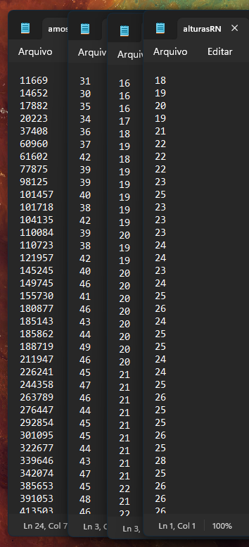
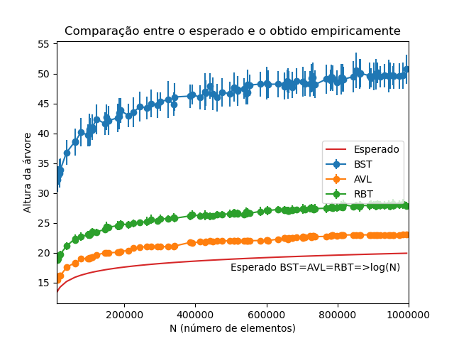
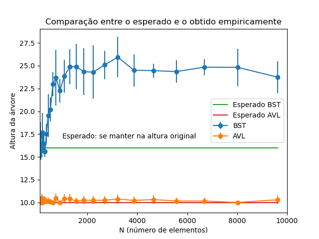
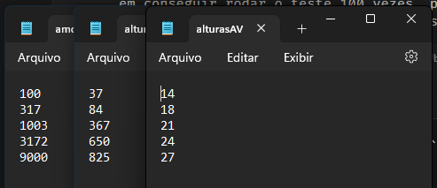
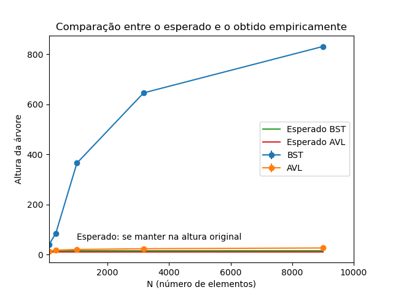

# Relatório do Trabalho de Estrutura de Dados II - Árvores

No código, as implementações das árvores podem ser encontradas em [src/estruturas/](src/estruturas/), os testes de implementação dessas árvores e das tarefas podem ser encontrados em [src/tests/](src/tests/), os dados gerados podem ser encontrados em [resultados/](resultados/), e a implementação dos gráficos pode ser encontrada em [plotlib/](plotlib/).

## Tarefa 1

```
Estime empiricamente a altura das diferentes árvores binárias de busca que estudamos no curso. Para medi-las empiricamente, execute 100 experimentos onde, para cada experimento, serão inseridas N chaves aleatórias em uma árvore inicialmente vazia e tire a média dos 100 experimentos. N deve ser variado entre 10^4 e 10^6. Para cada árvore, compare altura obtida com a altura esperada. As árvores a serem avaliadas serão: árvore binária de busca, árvore AVL e árvore rubro-negra. Monte um gráfico comparando o valor esperado com o valor obtido. Não esqueça de incluir o desvio padrão.
```

Foram realizados 100 testes, em que obtia 100 amostras de altura da árvore ao inserir aleatoriamente N entre 10000 e 1000000 elementos. Para árvores binárias de busca (BST), árvores AVL e árvores rubro-negras (RBT), os dados foram armazenados em texto para depois serem plotados em gráfico.

Foi plotado um gráfico com o resultado de todos os testes, obtendo uma média pra cada amostra de N, e o desvio padrão. O gráfico foi plotado com a biblioteca matplotlib do Python.



Esses foram os primeiros resultados obtidos do primeiro teste, no entanto esse teste rodou 100 vezes, sendo que a amostra apesar de ser aleatória, foi gerada com a mesma semente, para que os resultados fossem comparáveis. A árvore AVL (terceira coluna) obteve as menores alturas, seguida pela árvore rubro-negra (quarta coluna) e por último a árvore binária de busca (segunda coluna).



## Tarefa 2

```
Faça um experimento que construa uma árvore binária de busca aleatória de tamanho N, onde N varia entre 10^2 e 10^4. Depois, construa um loop que rode por N^2 vezes em que uma chave aleatória é removida (utilizando a técnica do sucessor) e outra inserida. Quando acabar o loop, faça a mesma avaliação do experimento anterior, verificando a altura da árvore e comparando com a altura esperada. Monte um gráfico comparando o valor esperado com o valor obtido. Não esqueça de incluir o desvio padrão. As árvores a serem avaliadas serão: árvore binária de busca e árvore AVL.
```

Para a segunda tarefa, houve uma complicação em obter um número de amostras razoável para plotar o gráfico, pois o tempo de execução escala de forma exponencial, além de ter problemas com heap. Por isso, foi feito um teste com bem menos amostras em que o passo também foi exponencial, portanto ficou bastante denso no início e bem espaçado no fim. Eu obtive dificuldades também em conseguir rodar o teste 100 vezes, pois o tempo de execução era muito alto, então eu rodei 50 vezes para conseguir um resultado satisfatório.

O gráfico foi plotado da mesma forma que o da tarefa 1.



## Tarefa 3

```
Execute o mesmo experimento anterior com uma implementação diferente: escolha aleatoriamente entre remover utilizando a técnica do sucessor ou do antecessor. Isso muda o resultado anterior?
```

Para a terceira tarefa, foi ainda mais difícil obter um número de amostras razoável para plotar o gráfico, e inclusive tive que deixar rodando na minha máquina e uma remota junta conseguir rodar ao menos 30 vezes. O passo teve que ser ainda mais espaçado. Um detalhe é que não foi consegui rodar o teste com N = 10000 sem ter problemas com heap, então precisei limitar o ultimo passo com min(N, 9000).



Todos os testes foram bem próximos disso. Da esquerda para a direita: N, altura da BST e altura da AVL.

O desvio padrão foi muito baixo, a AVL praticamente não teve desvio padrão, já BST teve alguma coisa que porém em relação à altura da árvore fica difícil de visualizar no gráfico.


